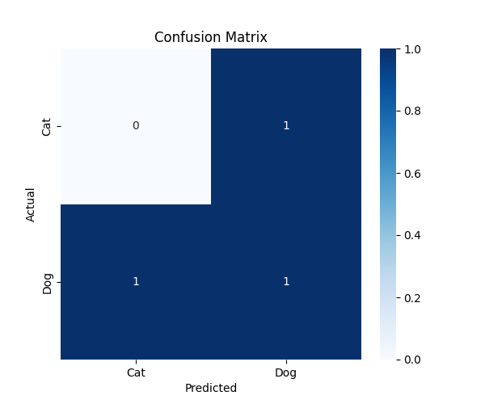

# 🐶🐱 Task 3 - Dog vs Cat Classification using SVM

This project aims to build a binary image classifier that can distinguish between cat and dog images using Support Vector Machine algorithms(SVM) The input is a set of cat and dog images stored in respective folders. The model is trained on flattened pixel data and evaluated using accuracy, classification report, and a confusion matrix.

---

## 📌 Objective

Build an image classifier using *Support Vector Machine (SVM)* to distinguish between dog and cat images.

---

## 📁 Dataset

- Folder: PetImages/
- Classes: Dog/ and Cat/
- Image size: Resized to 64x64 (grayscale)

⚠ Dataset from: [Kaggle - Dogs vs Cats](https://www.kaggle.com/c/dogs-vs-cats/data)  

---

## 🧰 Tools & Libraries

- Python
- OpenCV
- Scikit-learn
- Matplotlib
- Seaborn

---

## Folder Structure

SCT_DS_1\
|__Task3\
|  |__PerImages\
|     |__Cat\train\
|     |__Dog\train\
|__main.py
|__outout.png
|__README.md

---

## ⚙ Steps

1. Load and preprocess images
2. Flatten and label the data
3. Split into train/test
4. Train SVM classifier
5. Evaluate using accuracy and confusion matrix

---

## How to Run

1. Add images to:
   PetImages/Cat/train/
   PetImages/Dog/train
2. Run the main script
   python main.py

---

## 📊 Output Visualization

---

## 🎯 Result

- Accuracy: ~XX% (based on your test result)
- Model predicts cats and dogs using SVM with basic image features.

---

## What I Learnings

I learned how to build a basic image classifier using SVM I explored image preprocessing using Open CV and evaluated model performance using accuracy and confusion matrix. This task improved my understanding of machine learning workflows and real-time error debugging

---

## Github link

(https://github.com/Ananya953/SCT_DS_1.git)